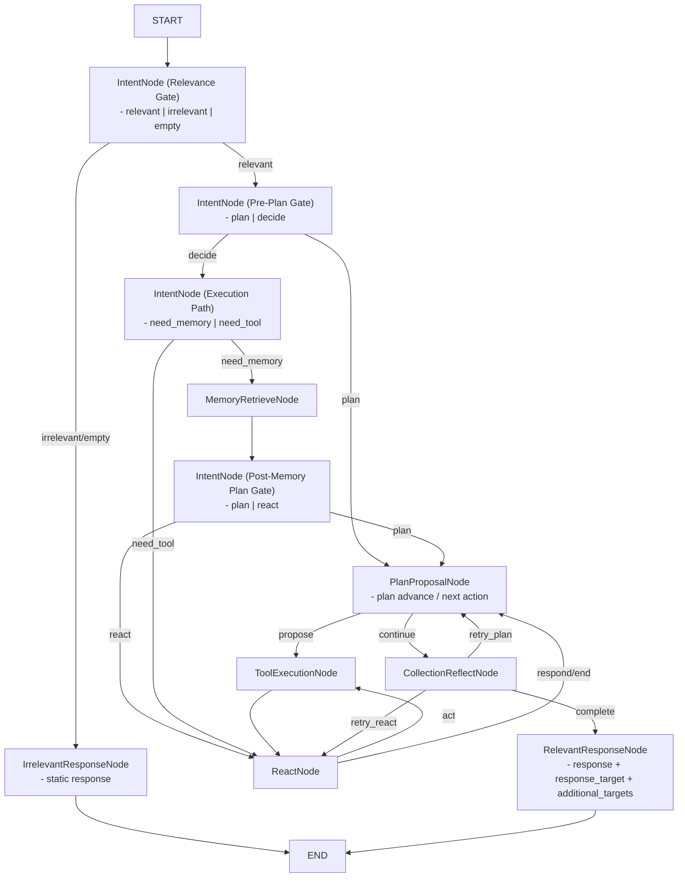

# Collection Agent

Main customer-facing collections agent.

## First-time setup (run-only)

Use this section when someone is running Collection Agent for the first time.

### 1) Python environment

From repo root (`/Users/saketm10/Projects/openclaw_agents`):

```bash
python3 -m venv .venv
source .venv/bin/activate
python -m pip install --upgrade pip
pip install -e .
```

Optional voice runtime dependencies:

```bash
pip install ".[voice-realtime]"
```

### 2) Environment variables

Collection Agent reads API keys from environment variables.

Create or update `.env` at repo root:

```bash
NVIDIA_API_KEY=nvapi-...
NVIDIA_BASE_URL=https://integrate.api.nvidia.com

# Only needed if you switch config to llm.provider=openai
OPENAI_API_KEY=sk-...
```

Load variables into the current shell:

```bash
set -a
source .env
set +a
```

Notes:

- Current default config uses `llm.provider: nvidia` in `agents/collection_agent/config.yml`.
- If `llm.provider=openai`, `OPENAI_API_KEY` becomes required.

### 3) Run Collection Agent (interactive CLI)

```bash
python agents/collection_agent/main.py --interactive --session-id collection-demo
```

### 4) Run Collection Agent UI

```bash
python -m agents.collection_agent.ui.server
```

Open:

- `http://127.0.0.1:8060/`

Alternative launcher used in this repo:

```bash
./ui-render.sh
```

### 5) Quick health check

```bash
curl http://127.0.0.1:8060/health
```

Expected response:

```json
{"status":"ok"}
```

## Core idea

- Graph handles one internal reasoning pass and always ends at response.
- Response includes both:
  - `response` text
  - `response_target` (`customer` | `self` | `discount_planning_agent`)
  - optional `additional_targets` (for example `collection_memory_helper_agent`)
- Outer orchestration loop in `main.py` decides who gets that response next.

## Collection Graph State Contract

Collection agent now uses a dedicated state schema (`agents/collection_agent/state.py`) layered on top of the shared framework state.

### Collection-specific keys

| Key | Purpose | First writer |
| --- | --- | --- |
| `user_id` | Active customer id for this turn | `CollectionAgent.run_turn` |
| `case_id` | Active case id for this turn | `CollectionAgent.run_turn` |
| `channel` | Active communication channel | `CollectionAgent.run_turn` |
| `relevance_intent` | Output of relevance gate | `relevance_intent` node |
| `pre_plan_intent` | Output of pre-plan router | `pre_plan_intent` node |
| `execution_path_intent` | Output of execution path router | `execution_path_intent` node |
| `post_memory_plan_intent` | Output of post-memory router | `post_memory_plan_intent` node |
| `node_history` | Per-turn node traversal list | wrapper in `CollectionAgent._wrap_node` |
| `previous_node` | Last executed node before current node | wrapper in `CollectionAgent._wrap_node` |
| `next_node` | Routed next node (or possible next nodes if route unresolved) | wrapper in `CollectionAgent._wrap_node` |
| `conversation_phase` | Current processing phase label | wrapper in `CollectionAgent._wrap_node` |
| `tool_errors` | Structured tool failure records | reserved (future hardening) |
| `response_metadata` | Extra response controls/labels | reserved (future hardening) |

### Cross-node update ownership (active today)

| State key(s) | Updated by |
| --- | --- |
| `relevance_intent`, `intent` | `relevance_intent` node (`CollectionIntentNode`) |
| `pre_plan_intent`, `intent` | `pre_plan_intent` node (`CollectionIntentNode`) |
| `execution_path_intent`, `intent` | `execution_path_intent` node (`CollectionIntentNode`) |
| `post_memory_plan_intent`, `intent` | `post_memory_plan_intent` node (`CollectionIntentNode`) |
| `memory_context`, `memory_retrievals` | `memory_retrieve` node |
| `decision`, `steps` | `react` node |
| `observation` | `tool_execution` node, then merged in `reflect` |
| `route`, `response_target`, `handoff_payload`, `additional_targets`, `memory_helper_trigger` | `plan_proposal` node |
| `reflection_feedback`, `reflection_complete` | `reflect` node |
| `response`, `response_target` normalization | `relevant_response` / `irrelevant_response` nodes |
| `node_history`, `previous_node`, `next_node`, `conversation_phase` | Node wrapper in `CollectionAgent._wrap_node` |

## Graph (single-pass)



Graph assets:

- `graph.mmd`
- `graph.png`
- `graph.jpg`

## Node Definitions

### `IntentNode (Relevance Gate)`

- Classifies whether input is in collections scope.
- Routes to relevant flow or immediate irrelevant response.

### `IrrelevantResponseNode`

- Produces static out-of-scope response.
- Terminates current graph pass.

### `IntentNode (Pre-Plan Gate)`

- Decides whether to start from plan proposal or execution path decision.

### `IntentNode (Execution Path)`

- Chooses between memory-first route or immediate tool/planning route.

### `MemoryRetrieveNode`

- Loads session memory context for better continuity and follow-up handling.

### `IntentNode (Post-Memory Plan Gate)`

- Re-evaluates whether to continue with plan proposal or React flow after memory retrieval.

### `ReactNode`

- Decides next operation (`act`, `respond`, `end`) and tool arguments when needed.

### `ToolExecutionNode`

- Executes selected tool and returns structured observation payload.

### `PlanProposalNode`

- Advances conversation plan, triggers plan revisions, and emits routing targets (`customer`, `self`, `discount_planning_agent`).
- Detects conversation termination and may add `collection_memory_helper_agent` to additional targets.

### `CollectionReflectNode`

- Checks if current pass is complete.
- Routes back for another planning cycle when output is incomplete.

### `RelevantResponseNode`

- Produces final response payload for this graph pass.
- Emits `response_target` and optional `additional_targets` for external orchestration in `main.py`.

## Outer routing (outside graph)

After graph ends at response:

1. if `response_target=customer` -> return to UI/user
2. if `response_target=self` -> re-run collection agent with internal response context
3. if `response_target=discount_planning_agent` -> call discount agent, store result in memory, re-run collection agent
4. if `additional_targets` contains `collection_memory_helper_agent` -> send full conversation payload to memory helper agent after turn completion

Implementation note:

- `CollectionAgent.run()` and `CollectionAgent.run_turn()` perform one forward graph pass only.
- Multi-agent hop orchestration is handled in `agents/collection_agent/main.py` interactive loop (not inside `CollectionAgent.run()`).
- Loop guards in interactive mode:
  - soft cap default: `10` hops (`--agent-hop-soft-cap`)
  - hard cap default: `50` hops (`--agent-hop-hard-cap`)
  - on cap hit, a memory flag is set (`agent_loop_blocked=true`) and collection agent returns a guardrail response.

## Tool Table

| Tool | Description | Typical Inputs | Typical Output |
| --- | --- | --- | --- |
| `case_fetch` | Retrieves borrower case records with DPD, overdue amount, risk band, and loan linkage so the agent can anchor all downstream decisions in case facts. | `case_id?`, `customer_id?`, `portfolio_id?` | `cases[]`, `total` |
| `case_prioritize` | Scores and orders delinquent cases so collections effort starts with highest-risk and highest-recovery opportunities. | `case_ids?`, `portfolio_id?` | `queue[]`, `total` |
| `contact_attempt` | Logs outreach attempts across channels and preserves reachability history for follow-up strategy and compliance traceability. | `case_id`, `channel?`, `reached?` | `attempt_id`, `status` |
| `customer_verify` | Performs challenge-based identity verification before exposing sensitive dues/policy/account details. | `case_id?`, `customer_id?`, `challenge_answers?` | `status`, `failed_attempts` |
| `loan_policy_lookup` | Fetches policy constraints (waiver/restructure/promise windows) that govern which offers can legally be proposed. | `case_id?`, `loan_id?` | policy object |
| `dues_explain_build` | Builds a borrower-friendly dues explanation that summarizes principal overdue, fees, and total payable amount. | `case_id` | `explanation`, `total_due` |
| `offer_eligibility` | Checks baseline concession eligibility and produces initial direction (`waiver`, `restructure`, or `none`) under policy rules. | `case_id`, `hardship_flag?`, `requested_waiver_pct?` | `allowed`, `offer_type`, `approved_waiver_pct` |
| `plan_propose` | Generates or revises repayment plan options (tenure + EMI) for hardship negotiation flows. | `case_id`, `revision_index?`, `max_installment_amount?` | `plan_id`, `monthly_amount`, `first_due_date`, `status` |
| `payment_link_create` | Creates a payment link for borrowers ready to pay now on digital channels. | `case_id`, `amount`, `channel?` | `payment_reference_id`, `payment_url` |
| `pay_by_phone_collect` | Simulates assisted payment collection over voice where borrower pays during the call. | `case_id`, `amount`, `consent_confirmed?` | `payment_id`, `status`, `receipt_reference` |
| `payment_status_check` | Verifies whether initiated payment is completed/pending/failed and whether more action is required. | `payment_reference_id` | `status`, `needs_additional_action` |
| `promise_capture` | Persists promise-to-pay commitments (amount/date/channel) for accountability and future tracking. | `case_id`, `promised_date`, `promised_amount` | `promise_id`, `status` |
| `followup_schedule` | Creates reminder/callback tasks when immediate payment is not possible. | `case_id`, `scheduled_for`, `preferred_channel?` | `schedule_id` |
| `disposition_update` | Writes final interaction disposition and notes for audit, reporting, and queue progression. | `case_id`, `disposition_code`, `notes` | `audit_id`, `updated_at` |
| `channel_switch` | Moves conversation to requested channel (voice/sms/email/whatsapp) while retaining interaction context. | `case_id`, `from_channel?`, `to_channel?` | `switch_id`, `carried_context_summary` |
| `human_escalation` | Escalates exceptional cases (fraud/legal/dispute/sensitive) to human specialist queues. | `case_id`, `reason` | `escalation_id`, `queue`, `priority` |

## Specialist agent used outside graph

- `agents/discount_planning_agent`
- `agents/collection_memory_helper_agent`

Collection agent does not treat specialist handoff as an internal graph node or tool.

## Pipecat voice runtime integration

Pipecat integration is added as a runtime adapter, not as an internal graph node.

- shared integration helpers: `src/interfaces/pipecat_runner.py`
- collection voice bot entrypoint: `agents/collection_agent/pipecat_bot.py`

### What this does

- Pipecat handles transport/session/audio IO (WebRTC, Daily, telephony transports).
- OpenAI STT converts caller audio to text.
- Text is routed to existing collection orchestration (`_route_internal_turn`) with discount and memory-helper handoffs unchanged.
- Returned text is converted back to speech via OpenAI TTS.

### Runtime config

Defined in `agents/collection_agent/config.yml` under `voice_runtime`:

- `stt_model`
- `tts_model`
- `tts_voice`
- `pipecat.vad_enabled`
- `pipecat.audio_in_sample_rate`
- `pipecat.audio_out_sample_rate`

### Run

```bash
# install optional dependencies
pip install ".[voice-realtime]"

# local browser WebRTC
python agents/collection_agent/pipecat_bot.py -t webrtc

# daily transport
python agents/collection_agent/pipecat_bot.py -t daily

# telephony transport via twilio (public proxy required)
python agents/collection_agent/pipecat_bot.py -t twilio -x <your-ngrok-domain>
```

## NVIDIA model setup (LLM provider)

Collection agent now supports `llm.provider: nvidia` using NVIDIA hosted Integrate API (OpenAI-compatible chat endpoint).

Update `agents/collection_agent/config.yml`:

```yaml
llm:
  enabled: true
  provider: nvidia
  model_name: meta/llama-3.1-70b-instruct
  base_url: https://integrate.api.nvidia.com
```

Set env:

```bash
export NVIDIA_API_KEY="nvapi-..."
```

Optional override at runtime:

```bash
python agents/collection_agent/main.py --interactive --nvidia-api-key "nvapi-..."
```

## Key-event memory stores

Both stores are physically under collection agent runtime so collection logic can read them directly:

- `agents/collection_agent/runtime/memory/global_key_event_memory.json`
  - cross-user successful/unsuccessful procedural cues
  - event counters and sample signals used as planning hints
- `agents/collection_agent/runtime/memory/user_key_event_memory.json`
  - per-`user_id` latest summary
  - per-`user_id` procedural key points + follow-up considerations
  - per-`user_id` conversation outcome history

## Regenerate graph

```bash
npx -y @mermaid-js/mermaid-cli -i agents/collection_agent/graph.mmd -o agents/collection_agent/graph.png -b white -s 2
python3 -c "from PIL import Image; Image.open('agents/collection_agent/graph.png').convert('RGB').save('agents/collection_agent/graph.jpg', 'JPEG', quality=92)"
```
