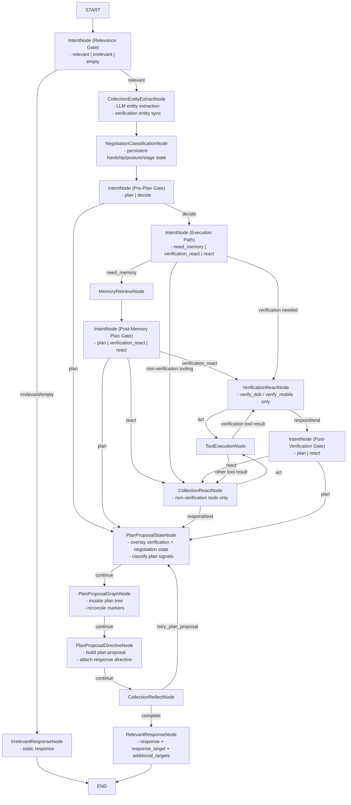

# Collection Agent

Main customer-facing collections agent.

## First-time setup (run-only)

Use this section when someone is running Collection Agent for the first time.

### 1) Python environment

From repo root (`/Users/saketm10/Projects/openclaw_agents`):

```bash
python3 -m venv .venv
source .venv/bin/activate
python -m pip install --upgrade pip
pip install -e .
```

Optional voice runtime dependencies:

```bash
pip install ".[voice-realtime]"
```

### 2) Environment variables

Collection Agent reads API keys from environment variables.

Create or update `.env` at repo root:

```bash
NVIDIA_API_KEY=nvapi-...
NVIDIA_BASE_URL=https://integrate.api.nvidia.com

# Only needed if you switch config to llm.provider=openai
OPENAI_API_KEY=sk-...
```

Load variables into the current shell:

```bash
set -a
source .env
set +a
```

Notes:

- Current default config uses `llm.provider: nvidia` in `agents/collection_agent/config.yml`.
- If `llm.provider=openai`, `OPENAI_API_KEY` becomes required.

### 3) Run Collection Agent (interactive CLI)

```bash
python agents/collection_agent/main.py --interactive --session-id collection-demo
```

### 4) Run Collection Agent UI

```bash
python -m agents.collection_agent.ui.server
```

Open:

- `http://127.0.0.1:8060/`

Alternative launcher used in this repo:

```bash
./ui-render.sh
```

### 5) Quick health check

```bash
curl http://127.0.0.1:8060/health
```

Expected response:

```json
{"status":"ok"}
```

## Core idea

- Graph handles one internal reasoning pass and always ends at response.
- Response includes both:
  - `response` text
  - `response_target` (`customer` | `self` | `discount_planning_agent`)
  - optional `additional_targets` (for example `collection_memory_helper_agent`)
- Outer orchestration loop in `main.py` decides who gets that response next.

## Collection Data Architecture

Collection Agent is an outbound collections workflow. Most customer, case, policy, and negotiation-supporting facts are loaded before the graph starts.

Preloaded datasets:

- `customers.json`
- `cases.json`
- `policies.json`
- `customer_profile.json`
- `payment_history.json`
- `offer_history.json`
- `assistance_programs.json`

`CollectionContextBuilder` aggregates those records into one `active_collection_context` object before graph execution. That context is injected into:

- graph state for the current turn
- session memory for cross-turn reuse
- compact summaries used by negotiation classification and planning prompts

As a result, nodes operate primarily on state rather than repeatedly reading JSON or calling retrieval-style tools. Verification and action execution remain external.

## Collection Graph State Contract

Collection Agent uses:

- Graph state (per turn/pass): `agents/collection_agent/state.py`
- Session memory (persistent across turns): `memory.state` in `SessionStore`

Important: Graph state is rebuilt each run; session memory survives across turns.

### 1) Turn lifecycle and baseline graph state

`CollectionAgent.run_turn()` initializes baseline graph state before the graph starts:

- `session_id`, `turn_id`, `user_input`
- `message_source` (`customer`/`admin`/`self`)
- `user_id`, `case_id`, `channel`
- `memory` (session object)
- `conversation_history` (copied from memory for this turn)
- `observation=None`, `steps=0`
- `node_history=[]`, `conversation_phase="turn_started"`
- `tool_errors=[]`
- `conversation_plan` (copied from `memory.state.active_conversation_plan` when present)
- `turn_index`

### 2) Graph-state keys you will see during execution

| Key | Meaning | Typical writer |
| --- | --- | --- |
| `relevance_intent` | Relevance classification payload (`intent`, `confidence`, `reason`) | `relevance_intent` |
| `negotiation_classification` | Persistent negotiation-state classification payload | `negotiation_classification` |
| `pre_plan_intent` | Pre-plan route intent (`plan`/`decide`) | `pre_plan_intent` |
| `execution_path_intent` | Decide execution route (`need_memory`/`verification_react`/`react`) | `execution_path_intent` |
| `post_memory_plan_intent` | Post-memory route intent (`plan`/`verification_react`/`react`) | `post_memory_plan_intent` |
| `post_verification_intent` | Post-verification route intent (`plan`/`react`) | `post_verification_intent` |
| `intent` | Compatibility mirror of current intent payload | each intent node |
| `route` | Current routing decision for the node | inferred in node wrapper |
| `node_history` | Exact node traversal order for this run | node wrapper |
| `previous_node` | Previous node in this run | node wrapper |
| `next_node` | Resolved next node (or candidates) | node wrapper |
| `conversation_phase` | Phase label (`entity_extraction`, `plan_proposal_state`, etc.) | node wrapper |
| `decision` | ReAct decision object (tool call or direct response intent) | `react`, `verification_react` |
| `observations` | Canonical ordered tool observation history for this pass | `tool_execution` |
| `observation` | Latest observation compatibility mirror | `tool_execution` |
| `extracted_entities` | Session-level merged extracted entities | `entity_extract` |
| `extracted_entities_turn` | Entities extracted in current turn only | `entity_extract` |
| `extracted_entity_descriptions` | Descriptions/schema hints for extracted fields | `entity_extract` |
| `extracted_entities_updated_fields` | Fields changed vs previous memory snapshot | `entity_extract` |
| `verification_entities` | Verification-focused entity map (name/dob/phone, etc.) | `entity_extract` |
| `customer_profile` | Loaded customer behavioral profile record | pre-turn context builder |
| `customer_profile_summary` | Compact customer-profile summary for prompts/debugging | pre-turn context builder |
| `payment_history` | Loaded payment-history record | pre-turn context builder |
| `payment_history_summary` | Compact payment-history summary for prompts/debugging | pre-turn context builder |
| `offer_history` | Loaded settlement / offer history record | pre-turn context builder |
| `offer_history_summary` | Compact offer-history summary for prompts/debugging | pre-turn context builder |
| `assistance_programs` | Assistance / hardship program records relevant to the case | pre-turn context builder |
| `active_collection_context` | Aggregated customer+case+policy+history context payload | pre-turn context builder |
| `verified_dob` | Boolean mirror for DOB verification success | `verification_react` |
| `verified_mobile` | Boolean mirror for mobile verification success | `verification_react` |
| `verification_missing_fields` | Verification fields still missing | `verification_react` |
| `verification_verified_fields` | Verified verification fields | `verification_react` |
| `identity_verified` | Whether verification is complete | `verification_react` |
| `conversation_mode` | Persistent collections / hardship / verification dialogue mode | `negotiation_classification` |
| `negotiation_stage` | Negotiation-stage progression state | `negotiation_classification` |
| `customer_payment_posture` | Customer payment posture classification | `negotiation_classification` |
| `customer_payment_posture_history` | Historical posture transitions for analytics and continuity | memory layer |
| `customer_payment_capacity` | Absolute amount the customer says they can pay | `entity_extract` |
| `customer_payment_capacity_pct` | Percentage/proportion the customer says they can pay | `entity_extract` |
| `discount_stage` | Discount / settlement negotiation lifecycle stage | `negotiation_classification` |
| `customer_payment_willingness` | 0.0-1.0 willingness score for payment intent analytics | `negotiation_classification` |
| `hardship_context` | Persistent hardship detection payload | `negotiation_classification` |
| `discount_requested` | Sticky analytics flag that discount/settlement review has been requested | `negotiation_classification`, `plan_proposal_directive` |
| `discount_offered` | Sticky analytics flag that a specialist recommendation has been returned | `negotiation_classification`, `plan_proposal_directive` |
| `discount_accepted` | Sticky analytics flag that the customer accepted a discount outcome | `negotiation_classification` |
| `discount_rejected` | Sticky analytics flag that the customer rejected a discount outcome | `negotiation_classification` |
| `counter_offer_present` | Sticky analytics flag that the customer proposed an alternate amount | `negotiation_classification`, `plan_proposal_directive` |
| `response_mode` | Downstream tone/response-mode hint | `negotiation_classification` |
| `active_dialogue_owner` | Component that should lead the next customer-facing dialogue | `negotiation_classification` |
| `plan_proposal` | Planner proposal payload (target, outline, next actions, tree update) | `plan_proposal_directive` |
| `conversation_plan` | Current plan tree snapshot for this run | `plan_proposal_graph` |
| `plan_prepared_memory_state` | Verification/negotiation-overlaid memory snapshot used by planning | `plan_proposal_state` |
| `plan_signals` | Planning signal classification payload | `plan_proposal_state` |
| `plan_mode` | Effective planning mode (`strict_collections` or `hardship_negotiation`) | `plan_proposal_state` |
| `plan_tree_context` | Compact plan-tree view for prompt/debug use | `plan_proposal_graph` |
| `plan_graph_debug` | Graph-mutation debug payload | `plan_proposal_graph` |
| `routing_context.plan_origin` | Origin of planner invocation (`pre_plan_intent`, `post_memory_plan_intent`, `verification_react`, etc.) | node wrapper |
| `reflection_feedback` | Reflect validation payload (`reason`, `is_complete`) | `reflect` |
| `reflection_complete` | Whether reflection accepted current proposal | `reflect` |
| `reflection_retry_count` | Retry counter used by reflect loop guard | `reflect` |
| `reflection_plan_retry_count` | Plan-specific retry counter | `reflect` |
| `failure_type` | Reflection failure class (`none`, `invalid_json`, `empty_response`, `policy_violation`, `missing_required_action`, `unsafe_disclosure`, `placeholder_leakage`, `invalid_state_claim`) | `reflect` |
| `correction_hints` | Reflect hints for planner retry | `reflect` |
| `retry_target` | Retry destination (`plan_proposal_state` or `none`) | `reflect` |
| `response` | Final customer/system response text for this pass | `relevant_response` / `irrelevant_response` |
| `response_target` | Routing target after graph (`customer`, `self`, `discount_planning_agent`) | `plan_proposal_directive`, normalized in response/finalizer |
| `additional_targets` | Optional extra recipients (for example memory helper) | `plan_proposal_directive` |
| `handoff_payload` | Payload for cross-agent handoff | `plan_proposal_directive` |
| `memory_helper_trigger` | Trigger payload for memory-helper follow-up | `plan_proposal_directive` |
| `conversation_history` | Bounded history also returned in output state | `relevant_response` |
| `prompt` | Rendered prompt for the current node (debug) | node-specific |
| `system_prompt` | Effective system prompt for the current node (debug) | node-specific |
| `llm_response` | Structured/raw LLM output captured for debugging | node-specific |
| `llm_error` | LLM exception text if generation failed | node-specific |
| `llm_status` | `used_llm`, `llm_error`, `prompt_rendered_no_output`, or fallback markers | node wrapper / node-specific |
| `fallback_reason` | Explicit fallback reason (for example provider rate-limit) | intent/response nodes |

### 3) Node ownership map (who updates what)

| Node | Primary graph-state updates |
| --- | --- |
| `relevance_intent` | `relevance_intent`, `intent`, debug keys (`prompt`, `llm_*`) |
| `entity_extract` | `extracted_entities`, `extracted_entities_turn`, `extracted_entity_descriptions`, `verification_entities`, `customer_payment_capacity`, `customer_payment_capacity_pct`, `memory_context`, debug keys |
| `negotiation_classification` | `negotiation_classification`, `conversation_mode`, `negotiation_stage`, `customer_payment_posture`, `discount_stage`, `customer_payment_willingness`, `hardship_context`, explicit discount outcome flags, `response_mode`, `active_dialogue_owner` |
| `pre_plan_intent` | `pre_plan_intent`, `intent`, debug keys |
| `execution_path_intent` | `execution_path_intent`, `intent`, debug keys |
| `memory_retrieve` | `memory_context`, `memory_retrievals` |
| `post_memory_plan_intent` | `post_memory_plan_intent`, `intent`, debug keys |
| `verification_react` | `decision`, `steps`, `verified_dob`, `verified_mobile`, `verification_verified_fields`, `verification_missing_fields`, `identity_verified` (+ debug keys when available) |
| `post_verification_intent` | `post_verification_intent`, `intent`, debug keys |
| `react` | `decision`, `steps` (+ debug keys when available) |
| `tool_execution` | `observations`, `observation` (+ writes session `tool_observations_history` via wrapper side-effect) |
| `plan_proposal_state` | `plan_prepared_memory_state`, `plan_signals`, `plan_mode`, `plan_origin`, `effective_identity_verified`, plan-state debug keys |
| `plan_proposal_graph` | `conversation_plan`, `plan_tree_context`, `plan_graph_debug`, `route`, `response_target` |
| `plan_proposal_directive` | `plan_proposal`, `response_target`, optional `handoff_payload`/`additional_targets`, directive debug keys |
| `reflect` | `reflection_feedback`, `reflection_complete`, retry/failure keys |
| `relevant_response` | `response`, `response_target`, `conversation_history`, debug keys |
| `irrelevant_response` | static `response`, `response_target` |
| wrapper (`_wrap_node`) | `node_history`, `previous_node`, `next_node`, default `conversation_phase`, inferred `route`, computed `llm_status` |

### 4) Persistent session memory keys (cross-turn)

These are not graph-state-only, but they drive graph behavior every turn:

- `active_user_id`, `active_case_id`, `active_channel`
- `active_customer_name`, `active_overdue_amount`, `active_emi_amount`, `active_late_fee`, `active_dpd`
- `active_verification_required_fields`, `active_verification_challenge`
- `customer_profile`, `customer_profile_summary`
- `payment_history`, `payment_history_summary`
- `offer_history`, `offer_history_summary`
- `assistance_programs`
- `active_collection_context`
- `verification_entities`, `verification_collected`
- `verification_verified_fields`, `verification_missing_fields`, `verification_last_status`
- `identity_verified`
- `conversation_mode`, `negotiation_stage`, `customer_payment_posture`
- `customer_payment_posture_history`
- `customer_payment_capacity`, `customer_payment_capacity_pct`
- `discount_stage`, `customer_payment_willingness`
- `hardship_context`, explicit discount outcome flags, `response_mode`, `active_dialogue_owner`
- `active_conversation_plan`
- `conversation_history` (bounded, currently last 40 entries)
- `tool_observations_history` (bounded, currently last 40 entries)
- `last_user_input`, `last_agent_response`, `last_response_target`, `turn_index`

### 5) Quick debug checks

When behavior looks wrong, inspect these first in order:

1. `node_history` (did graph visit expected nodes?)
2. `route`, `next_node`, `conversation_phase` (was routing correct?)
3. `verification_entities`, `verification_missing_fields`, `verification_verified_fields`, `identity_verified` (verification stage truth)
4. `conversation_mode`, `negotiation_stage`, `customer_payment_posture`, `discount_stage` (negotiation continuity truth)
5. `customer_payment_capacity`, `customer_payment_capacity_pct`, `customer_payment_willingness`, `customer_payment_posture_history` (payment analytics + transition truth)
6. `plan_proposal` + `conversation_plan.current_node_id` + `handoff_payload` (planner stage and specialist routing)
7. `reflection_feedback` + `reflection_complete` (retry loop reason)
8. `response` + `response_target` (final output contract)

## Graph (single-pass)



Graph assets:

- `graph.mmd`
- `graph.png`
- `graph.jpg`

## Batch Evaluation Dataset

`BatchExecutionRunner` uses the collection-agent evaluation dataset directory by default:

- `agents/collection_agent/eval_dataset/`

Default dataset:

- `agents/collection_agent/eval_dataset/collection_agent_golden_dataset_950.jsonl`

Behavior:

- auto-discover all `*.jsonl` files under `eval_dataset/`
- allow explicit `dataset_path` override
- load one script per JSONL record
- preserve all fields from the source dataset in execution artifacts
- include `script_id` and `run_id` in every trace artifact

Example:

```python
from agents.collection_agent.evaluation import BatchExecutionRunner

runner = BatchExecutionRunner(
    dataset_path="agents/collection_agent/eval_dataset/collection_agent_golden_dataset_950.jsonl"
)
result = runner.run()
```

Validation requirements:

- every dataset `script_id` must appear in `run_summary.csv`
- every dataset `script_id` must appear in `conversations.jsonl`
- `script_id` is the primary join key across dataset rows, execution traces, metrics, replay, and debugging

## Node Definitions

### `IntentNode (Relevance Gate)`

- Classifies whether input is in collections scope.
- Routes to relevant flow or immediate irrelevant response.

### `IrrelevantResponseNode`

- Produces static out-of-scope response.
- Terminates current graph pass.

### `CollectionEntityExtractNode`

- Runs immediately after relevance pass for in-scope turns.
- Extracts entities (LLM-first) and syncs verification entities before planning/routing.
- Owns `customer_payment_capacity` and `customer_payment_capacity_pct` extraction when the customer states an amount or proportion they can pay.

### `NegotiationClassificationNode`

- Runs immediately after entity extraction.
- Consumes `customer_profile_summary`, `payment_history_summary`, `offer_history_summary`, hardship context, and the current utterance when available.
- Classifies and persists `conversation_mode`, `negotiation_stage`, `customer_payment_posture`, `discount_stage`, `customer_payment_willingness`, `hardship_context`, explicit discount outcome flags, `response_mode`, and `active_dialogue_owner`.
- Preserves hardship negotiation continuity across turns without selecting tools directly.
- Supports posture transitions such as `cannot_pay -> partial_now -> pay_now` without losing historical posture evidence.
- Does not own payment-capacity fields or posture history.

### `IntentNode (Pre-Plan Gate)`

- Decides whether to start from plan proposal or execution path decision.

### `IntentNode (Execution Path)`

- Chooses between memory-first route or immediate tool/planning route.

### `MemoryRetrieveNode`

- Loads session memory context for better continuity and follow-up handling.

### `IntentNode (Post-Memory Plan Gate)`

- Re-evaluates whether to continue with plan proposal, verification React, or non-verification React after memory retrieval.

### `VerificationReactNode`

- Owns verification progression state (`verified_dob`, `verified_mobile`, `verification_verified_fields`, `verification_missing_fields`, `identity_verified`).
- Uses `observations` as the authoritative execution history and selects verification tools only.

### `IntentNode (Post-Verification Gate)`

- Chooses whether verification completion should return to planning or continue with non-verification tool planning.

### `CollectionReactNode`

- Decides next operation (`act`, `respond`, `end`) and tool arguments for non-verification tools only.

### `ToolExecutionNode`

- Executes selected tool and appends normalized `{tool_name, input, output}` observation entries.

### `PlanProposalStateNode`

- Prepares planning state before graph mutation.
- Owns verification/negotiation state overlay, effective planning mode, and plan-signal classification.
- Emits `plan_prepared_memory_state`, `plan_signals`, `plan_mode`, and plan-state debug payloads.

### `PlanProposalGraphNode`

- Owns conversation-plan graph mutation and marker reconciliation.
- Preserves plan history while updating current and future path only.
- Emits `conversation_plan` plus compact/debug graph views.

### `PlanProposalDirectiveNode`

- Builds the final `plan_proposal` payload and `response_directive`.
- Assigns routing targets (`customer`, `self`, `discount_planning_agent`) and optional handoff payloads.
- Routes to `discount_planning_agent` when hardship/cannot-pay, settlement/discount requests, partial-payment proposals, counter-offers, or discount lifecycle stages require specialist planning.
- Emits richer discount handoff payloads including payment capacity, percentage capacity, hardship reason, lifecycle stage, and posture.
- Detects conversation termination and may add `collection_memory_helper_agent` to additional targets.
- Reads verification progression from graph-owned verification state and negotiation continuity from graph/memory overlays.
- Does not own `discount_stage`; it only consumes the classified stage and forwards it inside handoff payloads.

### `CollectionReflectNode`

- Checks if current pass is complete.
- Routes back for another planning cycle when output is incomplete.

### `RelevantResponseNode`

- Produces final response payload for this graph pass.
- Emits `response_target` and optional `additional_targets` for external orchestration in `main.py`.

## Outer routing (outside graph)

After graph ends at response:

1. if `response_target=customer` -> return to UI/user
2. if `response_target=self` -> re-run collection agent with internal response context
3. if `response_target=discount_planning_agent` -> call discount agent, store result in memory, re-run collection agent
4. if `additional_targets` contains `collection_memory_helper_agent` -> send full conversation payload to memory helper agent after turn completion

Implementation note:

- `CollectionAgent.run()` and `CollectionAgent.run_turn()` perform one forward graph pass only.
- Multi-agent hop orchestration is handled in `agents/collection_agent/main.py` interactive loop (not inside `CollectionAgent.run()`).
- Loop guards in interactive mode:
  - soft cap default: `10` hops (`--agent-hop-soft-cap`)
  - hard cap default: `50` hops (`--agent-hop-hard-cap`)
  - on cap hit, a memory flag is set (`agent_loop_blocked=true`) and collection agent returns a guardrail response.

## Runtime Tool Catalogs

### Verification catalog

| Tool | Description | Typical Inputs | Typical Output |
| --- | --- | --- | --- |
| `verify_dob` | Verifies customer DOB against the active case challenge before sensitive dues disclosure. | `case_id?`, `customer_id?`, `dob` | `status`, `field=dob`, `failed_attempts` |
| `verify_mobile` | Verifies customer mobile number against the active case challenge before sensitive dues disclosure. | `case_id?`, `customer_id?`, `phone` | `status`, `field=phone`, `failed_attempts` |

### Non-verification catalog

| Tool | Description | Typical Inputs | Typical Output |
| --- | --- | --- | --- |
| `loan_policy_lookup` | Fetches policy constraints that govern waiver, restructure, and promise behavior. | `case_id?`, `loan_id?` | policy object |
| `offer_eligibility` | Evaluates concession or arrangement eligibility under current policy. | `case_id`, `hardship_flag?`, `requested_waiver_pct?` | `allowed`, `offer_type`, `approved_waiver_pct` |
| `plan_propose` | Generates or revises repayment plan options for hardship or arrangement negotiation. | `case_id`, `revision_index?`, `max_installment_amount?`, `hardship_reason?` | `plan_id`, `monthly_amount`, `first_due_date`, `status` |
| `payment_link_create` | Creates a pay-now link for borrowers ready to pay immediately. | `case_id`, `amount`, `channel?` | `payment_reference_id`, `payment_url` |
| `promise_capture` | Persists promise-to-pay commitments for follow-up tracking. | `case_id`, `promised_date`, `promised_amount` | `promise_id`, `status` |
| `human_escalation` | Escalates fraud, legal, dispute, or vulnerable-customer scenarios to a human queue. | `case_id`, `reason` | `escalation_id`, `queue`, `priority` |

### Internal helper tools used outside React catalogs

| Tool | Description | Typical Inputs | Typical Output |
| --- | --- | --- | --- |
| `entity_extract` | Extracts generic entities from raw input text for session state updates. | `text` | `entities`, `entity_keys` |
| `verification_entity_extract` | Extracts verification-relevant entities from raw input. | `text`, `required_fields`, `include_name?` | `entities`, `detected_fields`, `missing_fields` |
| `verification_memory_verify` | Verifies extracted entities against expected challenge values cached in memory. | `entities`, `expected_challenge`, `required_fields` | `status`, `matched`, `missing_fields`, `mismatched_fields` |

## Specialist agent used outside graph

- `agents/discount_planning_agent`
- `agents/collection_memory_helper_agent`

Collection agent does not treat specialist handoff as an internal graph node or tool.

## Negotiation state extensions

The collection graph now treats payment posture, payment capacity, and discount lifecycle as first-class state.

### Customer payment posture

Owner: `negotiation_classification`

Allowed values:

- `unknown`
- `pay_now`
- `partial_now`
- `promise_to_pay`
- `cannot_pay`
- `refuses_to_pay`
- `negotiating`

Examples:

- `"I can pay now"` -> `pay_now`
- `"I can pay 2000 today"` -> `partial_now`
- `"I will pay next Friday"` -> `promise_to_pay`
- `"I lost my job"` -> `cannot_pay`
- `"I am not paying anything"` -> `refuses_to_pay`
- `"Can we work something out?"` -> `negotiating`

### Customer payment capacity

Owner: `entity_extract`

Fields:

- `customer_payment_capacity`: absolute numeric amount
- `customer_payment_capacity_pct`: percentage/proportion on a 0-100 scale

Examples:

- `"I can pay 3000 today"` -> `customer_payment_capacity=3000`
- `"I can pay half"` -> `customer_payment_capacity_pct=50`

### Discount negotiation lifecycle

Owner: `negotiation_classification`

Allowed values:

- `none`
- `requested`
- `planning`
- `offered`
- `accepted`
- `rejected`
- `counter_offer`
- `closed`

### Explicit discount outcome flags

Used for analytics, evaluation, and easier downstream inspection:

- `discount_requested`
- `discount_offered`
- `discount_accepted`
- `discount_rejected`
- `counter_offer_present`

These are sticky booleans derived from lifecycle transitions and preserved across turns.

## Discount planning routing rules

`PlanProposalDirectiveNode` routes to `discount_planning_agent` when identity verification is complete and any of the following are true:

1. hardship exists and `customer_payment_posture=cannot_pay`
2. customer requests settlement
3. customer requests discount or waiver
4. customer proposes a partial payment (`partial_now`)
5. customer makes a counter-offer
6. `discount_stage=requested`
7. `discount_stage=counter_offer`

Typical handoff payload:

```json
{
  "case_id": "COLL-1001",
  "customer_id": "USER-1",
  "hardship_reason": "job_loss",
  "discount_stage": "requested",
  "customer_payment_posture": "partial_now",
  "customer_payment_capacity": 2000,
  "customer_payment_capacity_pct": null,
  "customer_payment_willingness": 0.8,
  "user_message": "I can pay 2000 today if you can settle this.",
  "requested_by": "collection_agent"
}
```

## Example negotiation flows

### Discount planning flow

1. Customer: "I lost my job and cannot pay the full EMI."
2. `negotiation_classification` sets:
   - `conversation_mode=hardship_negotiation`
   - `customer_payment_posture=cannot_pay`
   - `discount_stage=none`
3. `plan_proposal_directive` routes to `discount_planning_agent`
4. Graph/memory update:
   - `response_target=discount_planning_agent`
   - `discount_requested=true`
5. On later turns, `negotiation_classification` advances `discount_stage` from persisted context and specialist outcome evidence
6. Customer accepts or counters on later turns

### Partial payment flow

1. Customer: "I can pay 2000 today."
2. `entity_extract` sets `customer_payment_capacity=2000`
3. `negotiation_classification` sets `customer_payment_posture=partial_now`
4. `plan_proposal_directive` routes to `discount_planning_agent` with the partial-payment capacity in the handoff payload

### Posture transition flow

1. Turn 1: `"I lost my job"` -> `customer_payment_posture=cannot_pay`
2. Turn 5: `"I can pay 3000 today"` -> `customer_payment_posture=partial_now`
3. Turn 9: `"Send me the payment link"` -> `customer_payment_posture=pay_now`
4. `customer_payment_posture_history=["cannot_pay", "partial_now", "pay_now"]`

## Conversation Annotation Guidance

Future golden evaluation datasets should annotate:

- `customer_payment_posture`
- `customer_payment_capacity`
- `customer_payment_capacity_pct`
- `discount_stage`
- `customer_payment_willingness`
- `expected_response_target`
- `expected_handoff_payload`
- `expected_node_history`

Suggested annotation rules:

- annotate posture from the customer’s latest explicit payment stance, not from the agent’s interpretation alone
- annotate `customer_payment_capacity` only when an absolute amount is stated
- annotate `customer_payment_capacity_pct` only when a proportion or percentage is stated
- annotate `discount_stage=requested` for first discount/settlement asks
- annotate `discount_stage=counter_offer` when the customer proposes an alternate settlement or discounted amount after an offer/recommendation context exists
- annotate `expected_response_target=discount_planning_agent` whenever specialist routing should happen under the routing rules above
- annotate `expected_node_history` using the actual graph-node sequence you expect to see, not a natural-language summary

These annotations can be used as a golden evaluation dataset to check:

- state classification correctness
- routing correctness
- handoff payload completeness
- posture/lifecycle persistence across turns

## Migration notes for existing sessions

Existing sessions/memory states may not yet contain the new keys. `CollectionAgent._ensure_negotiation_state_defaults()` now backfills safe defaults on turn start:

- `customer_payment_posture_history=[]`
- `customer_payment_capacity=None`
- `customer_payment_capacity_pct=None`
- `discount_stage=none`
- `customer_payment_willingness=0.5`
- explicit discount outcome flags default to `false`

Old sessions that previously used posture labels such as `needs_arrangement` should be treated as legacy data and allowed to converge to the new posture taxonomy on subsequent turns.

## Pipecat voice runtime integration

Pipecat integration is added as a runtime adapter, not as an internal graph node.

- shared integration helpers: `src/interfaces/pipecat_runner.py`
- collection voice bot entrypoint: `agents/collection_agent/pipecat_bot.py`

### What this does

- Pipecat handles transport/session/audio IO (WebRTC, Daily, telephony transports).
- OpenAI STT converts caller audio to text.
- Text is routed to existing collection orchestration (`_route_internal_turn`) with discount and memory-helper handoffs unchanged.
- Returned text is converted back to speech via OpenAI TTS.

### Runtime config

Defined in `agents/collection_agent/config.yml` under `voice_runtime`:

- `stt_model`
- `tts_model`
- `tts_voice`
- `pipecat.vad_enabled`
- `pipecat.audio_in_sample_rate`
- `pipecat.audio_out_sample_rate`

### Verification pipeline config

Defined in `agents/collection_agent/config.yml` under `verification`:

- `required_fields`: which fields must match for verification (example: `dob`, `phone`)
- `require_field_in_challenge`: enforce only fields available in challenge payload
- `auto_verify_from_memory_evidence`: allow pre-graph memory verification to set `identity_verified`
- `require_name_match_for_auto_verify`: require extracted name match with active customer
- `tool_only_verification`: disable memory verification success; only `verify_dob`/`verify_mobile` can verify
- `prefer_memory_verify`: verify against cached memory challenge first
- `fallback_to_database_verify`: if memory verify is insufficient/failed, call database-backed `verify_dob`/`verify_mobile`
- `fallback_on_insufficient_entities`: if `false`, skip DB verify when required entities are still missing

### Run

```bash
# install optional dependencies
pip install ".[voice-realtime]"

# local browser WebRTC
python agents/collection_agent/pipecat_bot.py -t webrtc

# daily transport
python agents/collection_agent/pipecat_bot.py -t daily

# telephony transport via twilio (public proxy required)
python agents/collection_agent/pipecat_bot.py -t twilio -x <your-ngrok-domain>
```

## NVIDIA model setup (LLM provider)

Collection agent now supports `llm.provider: nvidia` using NVIDIA hosted Integrate API (OpenAI-compatible chat endpoint).

Update `agents/collection_agent/config.yml`:

```yaml
llm:
  enabled: true
  provider: nvidia
  model_name: meta/llama-3.1-70b-instruct
  base_url: https://integrate.api.nvidia.com
```

Set env:

```bash
export NVIDIA_API_KEY="nvapi-..."
```

Optional override at runtime:

```bash
python agents/collection_agent/main.py --interactive --nvidia-api-key "nvapi-..."
```

## Key-event memory stores

Both stores are physically under collection agent runtime so collection logic can read them directly:

- `agents/collection_agent/runtime/memory/global_key_event_memory.json`
  - cross-user successful/unsuccessful procedural cues
  - event counters and sample signals used as planning hints
- `agents/collection_agent/runtime/memory/user_key_event_memory.json`
  - per-`user_id` latest summary
  - per-`user_id` procedural key points + follow-up considerations
  - per-`user_id` conversation outcome history

## Regenerate graph

```bash
npx -y @mermaid-js/mermaid-cli -i agents/collection_agent/graph.mmd -o agents/collection_agent/graph.png -b white -s 2
python3 -c "from PIL import Image; Image.open('agents/collection_agent/graph.png').convert('RGB').save('agents/collection_agent/graph.jpg', 'JPEG', quality=92)"
```
