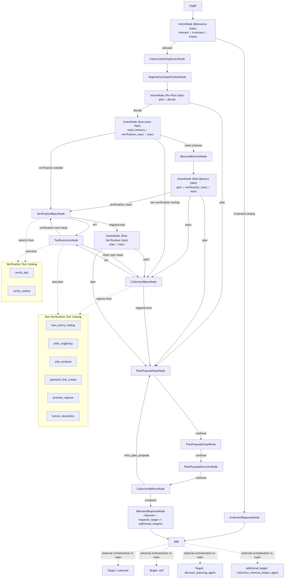

# Collection Agent Engineering Book

Version: 2026-05-04

Owner: Collections AI Engineering

---

## Table of Contents

1. Purpose and Scope
2. Business Process Mapping
3. System Architecture
4. Graph Topology and Runtime Loop
5. State Model and Memory Model
6. Node-by-Node Deep Dive
7. Tool Catalog Deep Dive
8. End-to-End Flow Walkthroughs
9. Sample Conversations
10. Code Ideology and Design Principles
11. How to Extend the Agent
12. Future Modification Playbook
13. Operational Runbook
14. Testing and Debugging Playbook
15. Appendix: Key Files

---

## 1) Purpose and Scope

The Collection Agent is a graph-driven debt-collection assistant for demo and pre-production workflows. It supports:

- outbound collections call opening
- identity verification before sensitive dues disclosure
- dues explanation and payment intent collection
- assistance path (discount/restructure) routing
- follow-up scheduling and disposition updates
- handoffs to specialist agents through orchestration loops outside the graph

The graph itself performs one bounded forward pass and always ends at a response node. Multi-hop orchestration (self-loop, specialist agent handoff, customer loop) happens in the outer runtime controller.

---

## 2) Business Process Mapping

Human collections-team actions mapped to graph + tools:

| Human activity | Graph phase | Main node/tool |
| --- | --- | --- |
| Select case and understand delinquency context | plan/bootstrap | `plan_proposal_state -> plan_proposal_graph -> plan_proposal_directive` |
| Contact borrower and establish call context | response packaging | `relevant_response` |
| Verify identity before details | plan + verify gate | `verify_identity` plan step + `verify_dob` / `verify_mobile` |
| Explain dues and options | planning + response | `plan_proposal_directive`, `loan_policy_lookup`, `relevant_response` |
| Ask payment intent and collect payment | execution | `payment_link_create` |
| If cannot pay, offer policy-compliant options | planning + tooling | `offer_eligibility`, `plan_propose` |
| Capture promise-to-pay commitment | execution | `promise_capture` |
| Escalate sensitive disputes | execution | `human_escalation` |
| Finalize and route response | planning + response | `plan_proposal_directive`, `relevant_response` |

---

## 3) System Architecture

### 3.1 Core components

- Graph runtime: `langgraph` state graph
- Node library: shared nodes under `src/nodes`, collection-specific nodes under `agents/collection_agent/nodes`
- Tooling: typed tool classes under `agents/collection_agent/tools`
- Session memory: `ConversationMemory` via `SessionStore`
- UI runtime: FastAPI debug server + web UI
- Voice runtime: Pipecat bridge process for call mode

### 3.2 Primary execution assets

- Graph definition: `agents/collection_agent/agent.py`
- Plan logic:
  - `agents/collection_agent/nodes/plan_proposal_state_node.py`
  - `agents/collection_agent/nodes/plan_proposal_graph_node.py`
  - `agents/collection_agent/nodes/plan_proposal_directive_node.py`
- Intent logic: `agents/collection_agent/nodes/collection_intent_node.py`
- Response packaging: `agents/collection_agent/nodes/collection_response_node.py`
- Prompt definitions: `agents/collection_agent/prompts/agent_prompts.yml`
- Tool descriptions: `agents/collection_agent/prompts/tool_catalog.yml`

---

## 4) Graph Topology and Runtime Loop

### 4.1 Graph asset



Also available:

- `agents/collection_agent/graph.mmd`
- `agents/collection_agent/graph.png`
- `agents/collection_agent/graph.jpg`

### 4.2 Topology semantics

- Start at `relevance_intent`
- Out-of-scope path terminates quickly through `irrelevant_response`
- In-scope path routes through `entity_extract`, then `negotiation_classification`, then pre-plan and execution gating
- Verification is isolated into `verification_react`
- Non-verification tools are isolated into `react`
- `tool_execution` routes back to the correct React node based on which tool just ran
- `plan_proposal_state` prepares planning state and classifies plan signals
- `plan_proposal_graph` creates/updates the plan tree and routing context
- `plan_proposal_directive` creates the final proposal and response directive
- `reflect` validates completion and may route back
- `relevant_response` packages final outward message

### 4.3 Outer-loop orchestration (outside graph)

After each pass, output includes:

- `response` (message)
- `response_target` (`customer` or `self`)
- optional `additional_targets`

Outer controller decides next recipient.

---

## 5) State Model and Memory Model

### 5.1 Core graph keys

- `session_id`, `turn_id`, `user_input`
- `user_id`, `case_id`, `channel`
- `node_history`, `previous_node`, `next_node`
- `conversation_phase`
- `response`, `response_target`, `route`
- `conversation_plan` (active plan tree)

### 5.2 Namespaced intent outputs

- `relevance_intent`
- `negotiation_classification`
- `pre_plan_intent`
- `execution_path_intent`
- `post_memory_plan_intent`
- `post_verification_intent`

### 5.3 Verification state (important)

- `identity_verified` (boolean)
- `verified_dob`
- `verified_mobile`
- `verification_verified_fields`
- `verification_missing_fields`
- `active_verification_required_fields` (required challenge keys)
- owned by `verification_react`

### 5.4 Negotiation cognition state

- `conversation_mode`
- `negotiation_stage`
- `customer_payment_posture`
- `customer_payment_posture_history`
- `customer_payment_capacity`
- `customer_payment_capacity_pct`
- `discount_stage`
- `customer_payment_willingness`
- `hardship_context`
- `discount_requested`
- `discount_offered`
- `discount_accepted`
- `discount_rejected`
- `counter_offer_present`
- `response_mode`
- `active_dialogue_owner`

### 5.5 Plan tree state

- `plan_id`, `version`, `status`
- `nodes[]`, `edges[]`
- `root_node_id`, `current_node_id`, `next_node_ids`
- `step_markers` with per-node state (`pending|done|skipped|blocked`)
- `timeline[]`, `revision_log[]`

---

## 6) Node-by-Node Deep Dive

### 6.1 `relevance_intent` (`CollectionIntentNode`)

Responsibilities:

- classify `relevant|irrelevant|empty`
- uses LLM structured output
- appends conversation context block to prompt
- applies context-aware relevance guard for identity replies in active sessions

Inputs:

- `user_input`
- memory context (`active_case_id`, `last_agent_response`, plan position)

Outputs:

- `relevance_intent`
- compatibility `intent`
- optional static response for irrelevant/empty

### 6.2 `pre_plan_intent` (`CollectionIntentNode`)

Responsibilities:

- classify `plan|decide`
- route directly to `plan_proposal_state` or deeper execution path

### 6.3 `negotiation_classification` (`NegotiationClassificationNode`)

Responsibilities:

- classify persistent conversation-level negotiation state
- detect and preserve hardship context across turns
- update `conversation_mode`, `negotiation_stage`, `customer_payment_posture`, `discount_stage`, `customer_payment_willingness`, `hardship_context`, explicit discount outcome flags, `response_mode`, and `active_dialogue_owner`
- consume `customer_profile_summary`, `payment_history_summary`, and `offer_history_summary` when available
- preserve posture transitions such as `cannot_pay -> partial_now -> pay_now`
- influence downstream planning and tone without selecting tools directly

### 6.4 `execution_path_intent` (`CollectionIntentNode`)

Responsibilities:

- classify `need_memory|verification_react|react`
- route verification candidates to verification flow when identity is still incomplete
- avoid unnecessary memory retrieval when direct tool action is enough

### 6.5 `memory_retrieve` (`MemoryRetrieveNode`)

Responsibilities:

- loads working memory context into graph state
- informs post-memory routing and planning

### 6.6 `post_memory_plan_intent` (`CollectionIntentNode`)

Responsibilities:

- classify `plan|verification_react|react` after memory hydration
- if plan-ready, route to `plan_proposal_state`
- if verification is still the blocker, route to `verification_react`
- otherwise route to non-verification `react`

### 6.7 `verification_react` (`VerificationReactNode`)

Responsibilities:

- own verification progression state
- recompute `verified_dob`, `verified_mobile`, `verification_verified_fields`, `verification_missing_fields`, and `identity_verified` from `observations`
- choose one of: `act`, `respond`, `end`
- only select verification tools (`verify_dob`, `verify_mobile`)

### 6.8 `post_verification_intent` (`CollectionIntentNode`)

Responsibilities:

- classify `plan|react` after verification work pauses or completes
- route back to `plan_proposal_state` when verification context is ready for planning
- route to non-verification `react` when immediate non-verification tooling is still required

### 6.9 `react` (`CollectionReactNode`)

Responsibilities:

- choose one of: `act`, `respond`, `end`
- when `act`, produce non-verification tool name + arguments
- when `respond/end`, hand control to `plan_proposal_state` for structured response planning
- consume negotiation continuity context without owning it

### 6.10 `tool_execution` (`ToolExecutionNode`)

Responsibilities:

- execute selected tool through registry/executor
- emit structured observation entries with `tool_name`, `input`, and `output`
- append those entries to canonical `observations`

### 6.11 `plan_proposal_state` (`PlanProposalStateNode`)

Responsibilities:

- overlay verification and negotiation state into a prepared planning snapshot
- classify plan signals and effective planning mode
- expose plan-state debug artifacts
- avoid mutating the conversation plan graph directly

### 6.12 `plan_proposal_graph` (`PlanProposalGraphNode`)

Responsibilities:

- build and update conversation plan tree
- maintain step markers and enforce predecessor gating
- preserve plan history and revise only current/future path
- use `identity_verified` as the primary verification gate for leaving `verify_identity`

Critical guardrail:

- `verify_identity` cannot be marked done unless verification progression state marks `identity_verified=true`

### 6.13 `plan_proposal_directive` (`PlanProposalDirectiveNode`)

Responsibilities:

- propose plan intent and next actions
- attach `response_directive`
- assign `response_target`
- emit specialist handoff payloads and termination/loop-guard proposals
- consume persistent negotiation cognition state to preserve hardship continuity
- route to `discount_planning_agent` for verified hardship/cannot-pay, discount or settlement asks, partial-payment proposals, counter-offers, and active `discount_stage` values `requested` / `counter_offer`
- consume classified `discount_stage` and include it in specialist handoff payloads without mutating ownership
- include payment capacity, percentage capacity, posture, hardship reason, and lifecycle stage in `handoff_payload`

### 6.14 `reflect` (`CollectionReflectNode`)

Responsibilities:

- assess whether output is complete
- route to `retry_plan_proposal` (`plan_proposal_state`) or `complete`

### 6.15 `relevant_response` (`CollectionResponseNode`)

Responsibilities:

- convert plan + state into user-facing message
- enforce target-safe message packaging (`customer` vs `self`)
- prevent internal graph/tool jargon leakage
- enforce verification guard before dues explanation
- apply `response_mode` and `active_dialogue_owner` to preserve negotiation tone and continuity

Verification guard behavior:

- if current step is `verify_identity` and `identity_verified=false`, response requests missing verification fields
- does not advance to dues explanation prematurely

### 6.16 `irrelevant_response` (`CollectionResponseNode` static mode)

Responsibilities:

- generate fixed out-of-scope response
- terminate pass safely

---

## 7) Tool Catalog Deep Dive

| Tool | Primary role | Inputs | Output contract | Notes |
| --- | --- | --- | --- | --- |
| `verify_dob` | DOB challenge verification | `case_id?`, `customer_id?`, `dob` | `status`, `field=dob`, `failed_attempts` | verification-only catalog |
| `verify_mobile` | mobile challenge verification | `case_id?`, `customer_id?`, `phone` | `status`, `field=phone`, `failed_attempts` | verification-only catalog |
| `loan_policy_lookup` | policy constraints | `case_id?`, `loan_id?` | policy object | non-verification catalog |
| `offer_eligibility` | concession eligibility | `case_id`, `hardship_flag?`, `requested_waiver_pct?` | `allowed`, `offer_type`, `approved_waiver_pct` | non-verification catalog |
| `plan_propose` | EMI plan proposal | `case_id`, `hardship_reason?`, `revision_index?`, `max_installment_amount?` | `plan_id`, `monthly_amount`, `first_due_date`, `status` | non-verification catalog |
| `payment_link_create` | digital payment | `case_id`, `amount`, `channel?` | `payment_reference_id`, `payment_url` | non-verification catalog |
| `promise_capture` | promise logging | `case_id`, `promised_date`, `promised_amount` | `promise_id`, `status` | non-verification catalog |
| `human_escalation` | specialist escalation | `case_id`, `reason` | `escalation_id`, `queue`, `priority` | non-verification catalog |

---

## 8) End-to-End Flow Walkthroughs

### Flow A: Standard collections call

1. Admin initializes case/customer context
2. Agent opens call and asks payment intent
3. Borrower asks for help
4. Agent asks identity verification details
5. Borrower provides required details
6. `verify_dob` and `verify_mobile` confirm verification
7. Agent explains dues and proposes payment
8. Borrower chooses pay-now or follow-up
9. Tool path executes and response closes turn

### Flow B: Incomplete identity

1. Borrower gives only name
2. Plan remains at `verify_identity`
3. Response asks for missing DOB / registered mobile number
4. No dues disclosure yet

### Flow C: Hardship route

1. Borrower says cannot pay
2. Plan shifts to `evaluate_assistance`
3. `offer_eligibility` + `plan_propose` path executed
4. Agent offers revised plan and asks commitment

---

## 9) Sample Conversations

### 9.1 Correct verification progression

Agent: Hello Aditi, this is Alex from the bank's collections team. I am calling regarding your loan account dues. Before I share details, please confirm your date of birth and registered phone number.

Customer: Sorry for the delay, how can you help me?

Agent: Before I share details, please confirm your date of birth (YYYY-MM-DD) and your registered phone number.

Customer: My name is Aditi Sharma.

Agent: Thank you for confirming your name. To complete verification, please also share your date of birth (YYYY-MM-DD) and your registered phone number.

### 9.2 Verified and dues explanation

Customer: DOB 1991-08-19 and my phone is 919900001001.

Agent: Thank you, verification is complete. Your total due is INR 13350. Would you like a payment link now, or do you need an arrangement?

### 9.3 Out-of-scope rejection

Customer: Tell me cricket score.

Agent: This request is outside collections scope. I can only help with loan dues, EMI, payments, verification, hardship plans, and follow-ups.

---

## 10) Code Ideology and Design Principles

### 10.1 Deterministic shell around probabilistic core

- LLM used for classification, planning, and message composition
- deterministic guards enforce compliance-critical transitions
- example: verify step cannot complete without verification progression state setting `identity_verified=true`

### 10.2 One-pass graph, explicit outer orchestration

- graph stays bounded and debuggable
- multi-agent or self-loop behavior orchestrated at outer layer

### 10.3 Namespaced state and typed tool contracts

- intent outputs namespaced by node role
- tool I/O validated by schema
- route logic remains explicit and inspectable

### 10.4 Human-debuggable traces first

- node-level trace events
- node history, previous/next node, phase labels
- state snapshots for UI right-pane debugging

---

## 11) How to Extend the Agent

### 11.1 Add a new tool

1. Create tool class file under `agents/collection_agent/tools/`
2. Define typed input/output schemas
3. Register tool in `CollectionAgent._build_tool_registry`
4. Add tool metadata to `prompts/tool_catalog.yml`
5. Update tool table in docs
6. Add test fixtures and sample conversation coverage

### 11.2 Add a new node

1. Implement node class under `agents/collection_agent/nodes/`
2. Add node in `CollectionAgent._build_graph`
3. Wire conditional/static edges
4. Update `_ROUTE_NEXT_NODE_MAP` / `_STATIC_NEXT_NODE_MAP`
5. Add phase mapping in `_phase_for_node`
6. Document state keys produced by node

### 11.3 Change verification policy

- customer challenge fields live in `agents/collection_agent/data/customers.json`
- verification output contracts live in `verify_dob_tool.py` and `verify_mobile_tool.py`
- plan completion gating in `plan_proposal_graph_node.py` and `plan_proposal_directive_node.py`
- customer-facing guard in `collection_response_node.py`

### 11.4 Add specialist agent handoff

1. Keep handoff out of internal graph topology
2. Emit target in `response_target` or `additional_targets`
3. Implement hop in outer orchestrator (`main.py` / UI runtime)
4. Ensure bounded hop cap and timeout guards

---

## 12) Future Modification Playbook

### High-priority improvements

- explicit conversation act model (intent + slot status + confidence)
- robust validation of `challenge_answers` extraction for voice transcripts
- stronger anti-hallucination guardrails in response packaging
- policy simulation mode vs strict production policy mode

### Medium-priority improvements

- replayable deterministic test harness for node/edge traversal
- branch quality scoring for plan-tree alternatives
- multilingual response style packs

### Long-term roadmap

- agent-to-agent protocol standardization
- unified memory service with retrieval quality metrics
- runtime policy engine with explainable decisions

---

## 13) Operational Runbook

### Start UI

```bash
cd /Users/saketm10/Projects/openclaw_agents
./ui-render.sh
```

### API health

```bash
curl http://127.0.0.1:8060/health
```

### Voice runtime (Pipecat test client)

- Web client URL typically hosted at `http://127.0.0.1:8788/client/`
- Keep collection UI and voice runtime logs separate

### Reset runtime data (optional)

- clear runtime traces and session files only when starting a fresh demo set
- keep fixtures in `data/` unchanged

---

## 14) Testing and Debugging Playbook

### 14.1 Identity progression test

- start user A
- send: `My name is Aditi Sharma`
- expected: asks for missing verification fields
- expected plan node: `verify_identity`
- expected marker state for verify step: `pending`

### 14.2 Verify completion test

- send full verification details
- run `verify_dob` and `verify_mobile`
- expected marker for `verify_identity`: `done`
- expected next node: `explain_dues`

### 14.3 Guardrail tests

- out-of-scope input should route to `irrelevant_response`
- tool failures should not auto-complete customer-owned steps
- self-target loops should honor hop limits

### 14.4 Discount and partial-payment lifecycle tests

- hardship + `customer_payment_posture=cannot_pay` should route to `discount_planning_agent` after verification
- direct settlement / waiver / discount ask should set `discount_stage=requested`
- partial payment such as `I can pay 2000 today` should populate `customer_payment_capacity=2000` and route to discount planning
- counter-offer after an offer context should set `discount_stage=counter_offer` and `counter_offer_present=true`
- specialist recommendation return should be reflected into classification-owned `discount_stage`

### 14.5 Conversation annotation guidance

For future golden datasets, annotate:

- `customer_payment_posture`
- `customer_payment_capacity`
- `customer_payment_capacity_pct`
- `discount_stage`
- `customer_payment_willingness`
- `expected_response_target`
- `expected_handoff_payload`
- `expected_node_history`

Use node history rather than natural-language summaries so orchestration regressions can be evaluated directly.

---

## 15) Appendix: Key Files

- `agents/collection_agent/agent.py`
- `agents/collection_agent/state.py`
- `agents/collection_agent/nodes/collection_intent_node.py`
- `agents/collection_agent/nodes/plan_proposal_state_node.py`
- `agents/collection_agent/nodes/plan_proposal_graph_node.py`
- `agents/collection_agent/nodes/plan_proposal_directive_node.py`
- `agents/collection_agent/nodes/collection_response_node.py`
- `agents/collection_agent/prompts/agent_prompts.yml`
- `agents/collection_agent/prompts/tool_catalog.yml`
- `agents/collection_agent/tools/verify_dob_tool.py`
- `agents/collection_agent/tools/verify_mobile_tool.py`
- `agents/collection_agent/ui/server.py`
- `agents/collection_agent/ui/app.js`

---

End of document.
