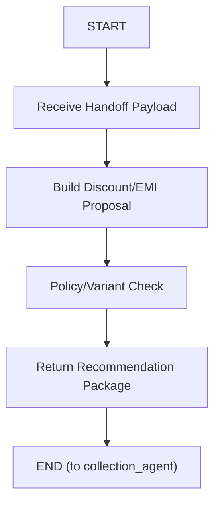

# Discount Planning Agent

Specialist agent under `agents/discount_planning_agent`.
It communicates only with `collection_agent` (agent-to-agent), not directly with customer.

## Role

- receives structured handoff payload from collection agent
- evaluates concession and EMI restructuring options
- returns recommendation package for collection agent to continue borrower conversation

## Graph



Graph assets:

- `graph.mmd`
- `graph.png`
- `graph.jpg`

## Node Definitions

### `Receive Handoff Payload`

- Accepts collection-agent handoff context (`case_id`, plan context, hardship hints, payment posture, payment capacity, discount lifecycle, counter-offer context, and targets).
- Normalizes payload for specialist processing.

### `Build Discount/EMI Proposal`

- Constructs candidate concession/restructure options.
- Balances repayment feasibility and collections recovery goals.

### `Policy/Variant Check`

- Validates candidate options against policy boundaries and internal constraints.
- Filters out non-compliant variants.

### `Return Recommendation Package`

- Returns normalized structured recommendation to collection agent:
- `recommended_offer`, `offer_variants`, `rationale`, `confidence`, `compliance_flags`, `next_action_hint`.

## Tool Table

| Tool | Description | Typical Inputs | Typical Output |
| --- | --- | --- | --- |
| `discount_policy_snapshot` | Consolidates policy boundaries (waiver caps, restructure allowances, tenure limits) to ensure all recommendations remain compliant. | `case_id`, `loan_id?` | policy bounds |
| `emi_plan_simulator` | Simulates feasible EMI-tenure combinations using target EMI and dues context to produce borrower-acceptable variants. | `case_id`, `target_monthly_emi?`, `principal_due?` | `variants[]`, `best_fit_variant` |
| `discount_offer_optimizer` | Ranks variants and selects the most recoverable and policy-safe recommendation with confidence and rationale. | `case_id`, `variants`, `max_discount_cap?` | `recommended_offer`, `offer_variants`, `confidence`, `rationale` |

## Handoff Input (from collection agent)

- `case_id`
- `current_plan` (optional)
- `dues_snapshot` (optional)
- `policy_constraints` (optional)
- `hardship_reason` (optional)
- `target_monthly_emi` (optional)
- `customer_payment_posture`
- `customer_payment_capacity` (optional numeric amount)
- `customer_payment_capacity_pct` (optional numeric percentage on 0-100 scale)
- `customer_payment_willingness` (optional float from 0.0 to 1.0)
- `customer_payment_posture_history` (optional ordered list of prior posture states)
- `discount_stage`
- `discount_requested`
- `discount_offered`
- `discount_accepted`
- `discount_rejected`
- `counter_offer_present`
- `previous_discount_offers` (optional list)
- `max_discount_cap` (optional)
- `reason_for_handoff`

Routing expectations:

- Invoke the discount planning specialist when the verified customer:
  - requests discount, settlement, or waiver
  - proposes partial payment as a negotiation basis
  - makes a counter-offer
  - remains in `discount_stage=requested` or `discount_stage=counter_offer`
  - has hardship plus `customer_payment_posture=cannot_pay`

The collection agent should include the current posture, capacity, willingness, hardship reason, discount lifecycle, and posture history on every specialist handoff so recommendation quality and future evaluation traces remain stable.

## Handoff Output (to collection agent)

- `recommended_offer`
- `offer_variants`
- `rationale`
- `compliance_flags`
- `confidence`
- `next_action_hint`

## Regenerate graph

```bash
npx -y @mermaid-js/mermaid-cli -i agents/discount_planning_agent/graph.mmd -o agents/discount_planning_agent/graph.png -b white -s 2
python3 -c "from PIL import Image; Image.open('agents/discount_planning_agent/graph.png').convert('RGB').save('agents/discount_planning_agent/graph.jpg', 'JPEG', quality=92)"
```
